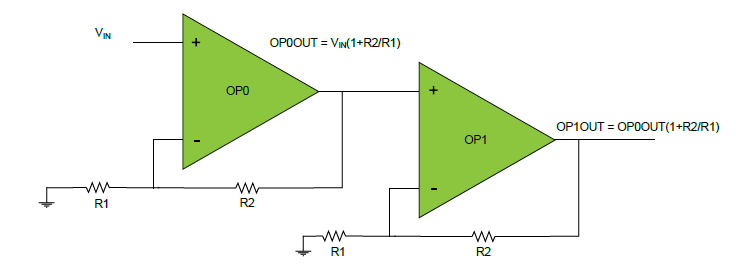

# Getting started with Mindi™ simulation and AVR®DB microcontrollers
This guide will get you up and running with simulating the analog OPAMP module in AVR DB family devices using the Mindi simulation tool.
## Configuration: (Two) Cascaded Non-Inverting PGA
This opamp configuration uses two op amps in a programmable gain configuration to enable a greater range of amplification. The amplification can be configured run-time by setting the feedback dividers.

### Mindi Simulation

Download and open the **Mindi schematic [here](schematics/)**

Press the _play_ button to simulate with an example stimulus source.

### Tweaking
The amplification of the individual amplifiers can be adjusted to any of 8 levels from 1.06 to 16 by changing the MUXWIP value in the control register. The Mindi schematic contains a table detailing the levels of gain and their associated register and resistor values.

### Updating composer fields
Once the desired result has been verified with Mindi simulation, the corrected values should be moved back into MCC/Start by copying resistor configuration values across to the composer of your preference.

### Don't have Mindi?
Download and install [Mindi simulation tool](https://www.microchip.com/mplab/mplab-mindi)
